# A Brazil Climate Estimate Cluster Analysis from 10-yr of INMET spatio-temporal data

*Marcos Conceição*, 2020

This notebook estimates Brazil climate types from 10 years of hourly measures from 561 meteorological stations. The original dataset station time series per year were downloaded from Instituto Nacional de Meteorologia (INMET) portal at [Dados Históricos - INMET](https://portal.inmet.gov.br/dadoshistoricos).

The series were compiled into a new dataset, with mean temperature, humidity, precipitation, pressure, and wind speed, as well as their dispersion (standard deviation metric was used) in a year. All these variables are given along with station coordinates, state and Brazil region on each row.

The motivation of this notebook is comparing climate clusters calculated from these dataset to Peel, *et. al.* (2007) results in their article: *Updated world map of the Koppen-Geiger climate classification*.

## Contents:

1. Dataset integrity check;
2. Recovery of missing data (weighted KNN regression);
3. Data visualization (weighted KNN regression interpolation);
4. Principal component analysis of numeric columns;
5. K-means cluster analysis (elbow and silhouette methods in the original and principal components domain);
6. Cluster analysis and characterization (weighted KNN classification);
7. Drawing schematic variable maps (weighted KNN classification);
8. Misc.: trying to use region categorical data;

## Importing libraries


```python
from os import listdir
from os.path import join, basename
from datetime import datetime, date, time, timedelta
from io import StringIO
import numpy as np
import pandas as pd
import seaborn as sns
import matplotlib as mpl
import matplotlib.pyplot as plt
import matplotlib.patches as patches
import matplotlib.ticker as mplticker
import cartopy.crs as crs
import cartopy.feature as cfeature
import cartopy.io.shapereader as shpreader
from cartopy.mpl.gridliner import LONGITUDE_FORMATTER, LATITUDE_FORMATTER
from shapely.vectorized import contains
from sklearn.preprocessing import StandardScaler
from sklearn.model_selection import train_test_split
from sklearn.decomposition import PCA
from sklearn.cluster import KMeans, DBSCAN
from sklearn.neighbors import KNeighborsRegressor, KNeighborsClassifier
from sklearn.mixture import GaussianMixture
from sklearn.metrics import mean_squared_error, accuracy_score
from sklearn.metrics import silhouette_samples, silhouette_score
sns.set_context('paper')
plt.style.use('seaborn-dark')
mpl.rc('image', cmap='viridis')
abc = [chr(i) for i in range(97,123)]
ABC = [i.upper() for i in abc]
```

## Opening data


```python
odf = pd.read_csv('inmet_2009_2019_yearly.csv')
odf.head()
```


<div>
<style scoped>
    .dataframe tbody tr th:only-of-type {
        vertical-align: middle;
    }

    .dataframe tbody tr th {
        vertical-align: top;
    }

    .dataframe thead th {
        text-align: right;
    }
</style>
<table border="1" class="dataframe">
  <thead>
    <tr style="text-align: right;">
      <th></th>
      <th>lat</th>
      <th>lon</th>
      <th>region</th>
      <th>state</th>
      <th>station</th>
      <th>H</th>
      <th>P</th>
      <th>R</th>
      <th>T</th>
      <th>V</th>
      <th>sH</th>
      <th>sP</th>
      <th>sR</th>
      <th>sT</th>
      <th>sV</th>
    </tr>
  </thead>
  <tbody>
    <tr>
      <th>0</th>
      <td>-15.789444</td>
      <td>-47.925833</td>
      <td>NE</td>
      <td>RN</td>
      <td>SANTA CRUZ</td>
      <td>65.450729</td>
      <td>887.287915</td>
      <td>113.008965</td>
      <td>21.527390</td>
      <td>2.324405</td>
      <td>16.636954</td>
      <td>2.060525</td>
      <td>56.675536</td>
      <td>3.434736</td>
      <td>1.117212</td>
    </tr>
    <tr>
      <th>1</th>
      <td>-15.599722</td>
      <td>-48.131111</td>
      <td>NE</td>
      <td>BA</td>
      <td>BARREIRAS</td>
      <td>63.415417</td>
      <td>888.740947</td>
      <td>131.155556</td>
      <td>21.908385</td>
      <td>2.318807</td>
      <td>15.382483</td>
      <td>1.644735</td>
      <td>44.732468</td>
      <td>3.314155</td>
      <td>1.329252</td>
    </tr>
    <tr>
      <th>2</th>
      <td>-15.939167</td>
      <td>-50.141389</td>
      <td>SE</td>
      <td>SP</td>
      <td>ARIRANHA</td>
      <td>62.718272</td>
      <td>954.701575</td>
      <td>111.373788</td>
      <td>25.655920</td>
      <td>1.086215</td>
      <td>16.226072</td>
      <td>1.781967</td>
      <td>69.084993</td>
      <td>4.065550</td>
      <td>1.061130</td>
    </tr>
    <tr>
      <th>3</th>
      <td>-3.103333</td>
      <td>-60.016389</td>
      <td>S</td>
      <td>RS</td>
      <td>BAGE</td>
      <td>74.779010</td>
      <td>1004.262176</td>
      <td>167.319125</td>
      <td>27.768980</td>
      <td>1.452776</td>
      <td>13.432962</td>
      <td>2.381811</td>
      <td>69.886715</td>
      <td>2.598391</td>
      <td>0.799783</td>
    </tr>
    <tr>
      <th>4</th>
      <td>-6.650278</td>
      <td>-69.866944</td>
      <td>S</td>
      <td>PR</td>
      <td>VENTANIA</td>
      <td>70.680097</td>
      <td>997.946723</td>
      <td>185.486389</td>
      <td>25.537133</td>
      <td>0.782401</td>
      <td>13.597679</td>
      <td>2.583953</td>
      <td>77.443203</td>
      <td>3.126108</td>
      <td>0.804853</td>
    </tr>
  </tbody>
</table>
</div>


```python
odf.describe().T
```


<div>
<style scoped>
    .dataframe tbody tr th:only-of-type {
        vertical-align: middle;
    }

    .dataframe tbody tr th {
        vertical-align: top;
    }

    .dataframe thead th {
        text-align: right;
    }
</style>
<table border="1" class="dataframe">
  <thead>
    <tr style="text-align: right;">
      <th></th>
      <th>count</th>
      <th>mean</th>
      <th>std</th>
      <th>min</th>
      <th>25%</th>
      <th>50%</th>
      <th>75%</th>
      <th>max</th>
    </tr>
  </thead>
  <tbody>
    <tr>
      <th>lat</th>
      <td>561.0</td>
      <td>-15.563160</td>
      <td>8.301153</td>
      <td>-33.741667</td>
      <td>-22.235278</td>
      <td>-15.935278</td>
      <td>-8.666389</td>
      <td>4.477500</td>
    </tr>
    <tr>
      <th>lon</th>
      <td>561.0</td>
      <td>-48.173564</td>
      <td>7.358577</td>
      <td>-72.786667</td>
      <td>-52.601111</td>
      <td>-48.131111</td>
      <td>-42.677222</td>
      <td>-29.316667</td>
    </tr>
    <tr>
      <th>H</th>
      <td>561.0</td>
      <td>72.265137</td>
      <td>7.939112</td>
      <td>49.935607</td>
      <td>67.231196</td>
      <td>72.696740</td>
      <td>78.343855</td>
      <td>90.559963</td>
    </tr>
    <tr>
      <th>P</th>
      <td>561.0</td>
      <td>967.169377</td>
      <td>37.722145</td>
      <td>763.268354</td>
      <td>943.495954</td>
      <td>973.575495</td>
      <td>998.794695</td>
      <td>1016.121159</td>
    </tr>
    <tr>
      <th>R</th>
      <td>561.0</td>
      <td>102.945187</td>
      <td>41.417317</td>
      <td>4.500000</td>
      <td>76.619646</td>
      <td>101.207163</td>
      <td>127.616667</td>
      <td>267.916667</td>
    </tr>
    <tr>
      <th>T</th>
      <td>561.0</td>
      <td>23.646605</td>
      <td>3.230790</td>
      <td>10.703426</td>
      <td>21.689522</td>
      <td>24.229970</td>
      <td>26.198640</td>
      <td>30.865950</td>
    </tr>
    <tr>
      <th>V</th>
      <td>561.0</td>
      <td>1.996727</td>
      <td>0.951947</td>
      <td>0.110801</td>
      <td>1.343852</td>
      <td>1.857584</td>
      <td>2.521674</td>
      <td>7.096284</td>
    </tr>
    <tr>
      <th>sH</th>
      <td>561.0</td>
      <td>15.483323</td>
      <td>2.558783</td>
      <td>4.706832</td>
      <td>14.311998</td>
      <td>16.090670</td>
      <td>17.085667</td>
      <td>20.625819</td>
    </tr>
    <tr>
      <th>sP</th>
      <td>561.0</td>
      <td>2.376282</td>
      <td>1.138982</td>
      <td>1.254278</td>
      <td>1.801416</td>
      <td>2.066448</td>
      <td>2.646520</td>
      <td>14.873817</td>
    </tr>
    <tr>
      <th>sR</th>
      <td>555.0</td>
      <td>65.429450</td>
      <td>20.821090</td>
      <td>1.944544</td>
      <td>52.339593</td>
      <td>64.542666</td>
      <td>77.467709</td>
      <td>175.008928</td>
    </tr>
    <tr>
      <th>sT</th>
      <td>561.0</td>
      <td>3.730761</td>
      <td>0.740771</td>
      <td>0.995349</td>
      <td>3.303974</td>
      <td>3.839485</td>
      <td>4.252713</td>
      <td>5.347374</td>
    </tr>
    <tr>
      <th>sV</th>
      <td>561.0</td>
      <td>1.233317</td>
      <td>0.370071</td>
      <td>0.190752</td>
      <td>0.992499</td>
      <td>1.191666</td>
      <td>1.417120</td>
      <td>3.881263</td>
    </tr>
  </tbody>
</table>
</div>


## Checking for NaNs and infinte values


```python
# column groups:
coord_cols = ['lon', 'lat']
dsc_cols = ['region', 'state', 'station']
cat_cols = ['NE', 'N', 'CO', 'S', 'SE']
num_cols = [c for c in odf.columns if c not in (lat_lon+dsc_cols+cat_cols)]
num_cols
```


    ['H', 'P', 'R', 'T', 'V', 'sH', 'sP', 'sR', 'sT', 'sV']


```python
null_mask = odf.isnull().T.any()
n_null = null_mask.sum()
print(f"Number of rows with null values: {n_null} ({n_null/odf.shape[0]:.0%}).")
```

    Number of rows with null values: 6 (1%).


```python
odf[null_mask]
```


<div>
<style scoped>
    .dataframe tbody tr th:only-of-type {
        vertical-align: middle;
    }

    .dataframe tbody tr th {
        vertical-align: top;
    }

    .dataframe thead th {
        text-align: right;
    }
</style>
<table border="1" class="dataframe">
  <thead>
    <tr style="text-align: right;">
      <th></th>
      <th>lat</th>
      <th>lon</th>
      <th>region</th>
      <th>state</th>
      <th>station</th>
      <th>H</th>
      <th>P</th>
      <th>R</th>
      <th>T</th>
      <th>V</th>
      <th>sH</th>
      <th>sP</th>
      <th>sR</th>
      <th>sT</th>
      <th>sV</th>
    </tr>
  </thead>
  <tbody>
    <tr>
      <th>25</th>
      <td>-4.250556</td>
      <td>-69.935000</td>
      <td>N</td>
      <td>PA</td>
      <td>MARABA</td>
      <td>74.939670</td>
      <td>1002.812203</td>
      <td>12.000000</td>
      <td>25.435670</td>
      <td>0.419304</td>
      <td>12.604709</td>
      <td>2.320246</td>
      <td>NaN</td>
      <td>3.895292</td>
      <td>0.662865</td>
    </tr>
    <tr>
      <th>26</th>
      <td>-4.530000</td>
      <td>-71.617500</td>
      <td>NE</td>
      <td>PB</td>
      <td>SAO GONCALO</td>
      <td>88.724039</td>
      <td>1000.832506</td>
      <td>208.100000</td>
      <td>25.919704</td>
      <td>0.474727</td>
      <td>13.882481</td>
      <td>2.110240</td>
      <td>NaN</td>
      <td>3.072027</td>
      <td>0.677580</td>
    </tr>
    <tr>
      <th>28</th>
      <td>-0.414444</td>
      <td>-65.017500</td>
      <td>CO</td>
      <td>MT</td>
      <td>CAMPO NOVO DOS PARECIS</td>
      <td>78.281039</td>
      <td>1006.630500</td>
      <td>99.142857</td>
      <td>26.235277</td>
      <td>0.110801</td>
      <td>13.027858</td>
      <td>1.907361</td>
      <td>NaN</td>
      <td>3.222528</td>
      <td>0.394585</td>
    </tr>
    <tr>
      <th>125</th>
      <td>-2.700000</td>
      <td>-44.850000</td>
      <td>SE</td>
      <td>MG</td>
      <td>AIMORES</td>
      <td>84.654529</td>
      <td>1009.107984</td>
      <td>133.000000</td>
      <td>26.512966</td>
      <td>0.703665</td>
      <td>11.308528</td>
      <td>1.577510</td>
      <td>NaN</td>
      <td>2.694260</td>
      <td>0.931435</td>
    </tr>
    <tr>
      <th>227</th>
      <td>-12.430000</td>
      <td>-64.420000</td>
      <td>SE</td>
      <td>SP</td>
      <td>PIRACICABA</td>
      <td>65.002010</td>
      <td>997.499012</td>
      <td>23.750000</td>
      <td>25.161809</td>
      <td>1.370702</td>
      <td>17.065660</td>
      <td>2.428062</td>
      <td>NaN</td>
      <td>4.685472</td>
      <td>1.091545</td>
    </tr>
    <tr>
      <th>343</th>
      <td>3.358889</td>
      <td>-59.823889</td>
      <td>CO</td>
      <td>GO</td>
      <td>JATAI</td>
      <td>69.594292</td>
      <td>1001.142434</td>
      <td>136.250000</td>
      <td>27.462531</td>
      <td>2.466772</td>
      <td>12.884847</td>
      <td>1.810201</td>
      <td>NaN</td>
      <td>2.725816</td>
      <td>1.167248</td>
    </tr>
  </tbody>
</table>
</div>


Data is missing in the **sR** column (yearly standard deviation of monthly precipitation).


```python
inf_mask = ~np.isfinite(odf[num_cols]).T.any()
n_inf = inf_mask.sum()
print(f"Number of rows with infinite values: {n_inf} ({n_inf/odf.shape[0]:.0%}).")
```

    Number of rows with infinite values: 0 (0%).


```python
odf[inf_mask]
```


<div>
<style scoped>
    .dataframe tbody tr th:only-of-type {
        vertical-align: middle;
    }

    .dataframe tbody tr th {
        vertical-align: top;
    }

    .dataframe thead th {
        text-align: right;
    }
</style>
<table border="1" class="dataframe">
  <thead>
    <tr style="text-align: right;">
      <th></th>
      <th>lat</th>
      <th>lon</th>
      <th>region</th>
      <th>state</th>
      <th>station</th>
      <th>H</th>
      <th>P</th>
      <th>R</th>
      <th>T</th>
      <th>V</th>
      <th>sH</th>
      <th>sP</th>
      <th>sR</th>
      <th>sT</th>
      <th>sV</th>
    </tr>
  </thead>
  <tbody>
  </tbody>
</table>
</div>


No infinite values.

## Interpolating missing data


```python
odf[null_mask]
```


<div>
<style scoped>
    .dataframe tbody tr th:only-of-type {
        vertical-align: middle;
    }

    .dataframe tbody tr th {
        vertical-align: top;
    }

    .dataframe thead th {
        text-align: right;
    }
</style>
<table border="1" class="dataframe">
  <thead>
    <tr style="text-align: right;">
      <th></th>
      <th>lat</th>
      <th>lon</th>
      <th>region</th>
      <th>state</th>
      <th>station</th>
      <th>H</th>
      <th>P</th>
      <th>R</th>
      <th>T</th>
      <th>V</th>
      <th>sH</th>
      <th>sP</th>
      <th>sR</th>
      <th>sT</th>
      <th>sV</th>
    </tr>
  </thead>
  <tbody>
    <tr>
      <th>25</th>
      <td>-4.250556</td>
      <td>-69.935000</td>
      <td>N</td>
      <td>PA</td>
      <td>MARABA</td>
      <td>74.939670</td>
      <td>1002.812203</td>
      <td>12.000000</td>
      <td>25.435670</td>
      <td>0.419304</td>
      <td>12.604709</td>
      <td>2.320246</td>
      <td>NaN</td>
      <td>3.895292</td>
      <td>0.662865</td>
    </tr>
    <tr>
      <th>26</th>
      <td>-4.530000</td>
      <td>-71.617500</td>
      <td>NE</td>
      <td>PB</td>
      <td>SAO GONCALO</td>
      <td>88.724039</td>
      <td>1000.832506</td>
      <td>208.100000</td>
      <td>25.919704</td>
      <td>0.474727</td>
      <td>13.882481</td>
      <td>2.110240</td>
      <td>NaN</td>
      <td>3.072027</td>
      <td>0.677580</td>
    </tr>
    <tr>
      <th>28</th>
      <td>-0.414444</td>
      <td>-65.017500</td>
      <td>CO</td>
      <td>MT</td>
      <td>CAMPO NOVO DOS PARECIS</td>
      <td>78.281039</td>
      <td>1006.630500</td>
      <td>99.142857</td>
      <td>26.235277</td>
      <td>0.110801</td>
      <td>13.027858</td>
      <td>1.907361</td>
      <td>NaN</td>
      <td>3.222528</td>
      <td>0.394585</td>
    </tr>
    <tr>
      <th>125</th>
      <td>-2.700000</td>
      <td>-44.850000</td>
      <td>SE</td>
      <td>MG</td>
      <td>AIMORES</td>
      <td>84.654529</td>
      <td>1009.107984</td>
      <td>133.000000</td>
      <td>26.512966</td>
      <td>0.703665</td>
      <td>11.308528</td>
      <td>1.577510</td>
      <td>NaN</td>
      <td>2.694260</td>
      <td>0.931435</td>
    </tr>
    <tr>
      <th>227</th>
      <td>-12.430000</td>
      <td>-64.420000</td>
      <td>SE</td>
      <td>SP</td>
      <td>PIRACICABA</td>
      <td>65.002010</td>
      <td>997.499012</td>
      <td>23.750000</td>
      <td>25.161809</td>
      <td>1.370702</td>
      <td>17.065660</td>
      <td>2.428062</td>
      <td>NaN</td>
      <td>4.685472</td>
      <td>1.091545</td>
    </tr>
    <tr>
      <th>343</th>
      <td>3.358889</td>
      <td>-59.823889</td>
      <td>CO</td>
      <td>GO</td>
      <td>JATAI</td>
      <td>69.594292</td>
      <td>1001.142434</td>
      <td>136.250000</td>
      <td>27.462531</td>
      <td>2.466772</td>
      <td>12.884847</td>
      <td>1.810201</td>
      <td>NaN</td>
      <td>2.725816</td>
      <td>1.167248</td>
    </tr>
  </tbody>
</table>
</div>


We must interpolate missing data via regression. We will use weighted KNN for this. Our inputs will be coordinates and all other variables, while our outputs will be precipitation standard deviation.

### Weighted KNN for data interpolation


```python
input_cols = [c for c in coord_cols+num_cols if c != 'sR']
```


```python
X = odf[~null_mask][input_cols]
y = odf[~null_mask]['sR']

X_train, X_test, y_train, y_test = train_test_split(X, y, test_size=1/4)
```


```python
knn = KNeighborsRegressor(9, weights='distance')
knn.fit(X_train, y_train)

ŷ_test = knn.predict(X_test)

rmse = np.sqrt(mean_squared_error(y_test, ŷ_test))
relerr = rmse/y_test.mean()
print(f'RMSE = {rmse} ({relerr:.2%})')
```

    RMSE = 11.467757546248682 (17.81%)


```python
X_null = odf[null_mask][input_cols]
ŷ_null = knn.predict(X_null)

print('Regression values for sR:')
print(*ŷ_null, sep='\n')
```

    Regression values for sR:
    27.42360601162177
    91.80061136340235
    76.09608449329014
    79.06089264282271
    29.067267876921477
    68.9678156447285


Now we will replace the NaNs in odf to create our modified dataframe, df:


```python
odf[null_mask]
```


<div>
<style scoped>
    .dataframe tbody tr th:only-of-type {
        vertical-align: middle;
    }

    .dataframe tbody tr th {
        vertical-align: top;
    }

    .dataframe thead th {
        text-align: right;
    }
</style>
<table border="1" class="dataframe">
  <thead>
    <tr style="text-align: right;">
      <th></th>
      <th>lat</th>
      <th>lon</th>
      <th>region</th>
      <th>state</th>
      <th>station</th>
      <th>H</th>
      <th>P</th>
      <th>R</th>
      <th>T</th>
      <th>V</th>
      <th>sH</th>
      <th>sP</th>
      <th>sR</th>
      <th>sT</th>
      <th>sV</th>
    </tr>
  </thead>
  <tbody>
    <tr>
      <th>25</th>
      <td>-4.250556</td>
      <td>-69.935000</td>
      <td>N</td>
      <td>PA</td>
      <td>MARABA</td>
      <td>74.939670</td>
      <td>1002.812203</td>
      <td>12.000000</td>
      <td>25.435670</td>
      <td>0.419304</td>
      <td>12.604709</td>
      <td>2.320246</td>
      <td>NaN</td>
      <td>3.895292</td>
      <td>0.662865</td>
    </tr>
    <tr>
      <th>26</th>
      <td>-4.530000</td>
      <td>-71.617500</td>
      <td>NE</td>
      <td>PB</td>
      <td>SAO GONCALO</td>
      <td>88.724039</td>
      <td>1000.832506</td>
      <td>208.100000</td>
      <td>25.919704</td>
      <td>0.474727</td>
      <td>13.882481</td>
      <td>2.110240</td>
      <td>NaN</td>
      <td>3.072027</td>
      <td>0.677580</td>
    </tr>
    <tr>
      <th>28</th>
      <td>-0.414444</td>
      <td>-65.017500</td>
      <td>CO</td>
      <td>MT</td>
      <td>CAMPO NOVO DOS PARECIS</td>
      <td>78.281039</td>
      <td>1006.630500</td>
      <td>99.142857</td>
      <td>26.235277</td>
      <td>0.110801</td>
      <td>13.027858</td>
      <td>1.907361</td>
      <td>NaN</td>
      <td>3.222528</td>
      <td>0.394585</td>
    </tr>
    <tr>
      <th>125</th>
      <td>-2.700000</td>
      <td>-44.850000</td>
      <td>SE</td>
      <td>MG</td>
      <td>AIMORES</td>
      <td>84.654529</td>
      <td>1009.107984</td>
      <td>133.000000</td>
      <td>26.512966</td>
      <td>0.703665</td>
      <td>11.308528</td>
      <td>1.577510</td>
      <td>NaN</td>
      <td>2.694260</td>
      <td>0.931435</td>
    </tr>
    <tr>
      <th>227</th>
      <td>-12.430000</td>
      <td>-64.420000</td>
      <td>SE</td>
      <td>SP</td>
      <td>PIRACICABA</td>
      <td>65.002010</td>
      <td>997.499012</td>
      <td>23.750000</td>
      <td>25.161809</td>
      <td>1.370702</td>
      <td>17.065660</td>
      <td>2.428062</td>
      <td>NaN</td>
      <td>4.685472</td>
      <td>1.091545</td>
    </tr>
    <tr>
      <th>343</th>
      <td>3.358889</td>
      <td>-59.823889</td>
      <td>CO</td>
      <td>GO</td>
      <td>JATAI</td>
      <td>69.594292</td>
      <td>1001.142434</td>
      <td>136.250000</td>
      <td>27.462531</td>
      <td>2.466772</td>
      <td>12.884847</td>
      <td>1.810201</td>
      <td>NaN</td>
      <td>2.725816</td>
      <td>1.167248</td>
    </tr>
  </tbody>
</table>
</div>


```python
df = odf.copy()
df.loc[null_mask, 'sR'] = ŷ_null
df[null_mask]
```


<div>
<style scoped>
    .dataframe tbody tr th:only-of-type {
        vertical-align: middle;
    }

    .dataframe tbody tr th {
        vertical-align: top;
    }

    .dataframe thead th {
        text-align: right;
    }
</style>
<table border="1" class="dataframe">
  <thead>
    <tr style="text-align: right;">
      <th></th>
      <th>lat</th>
      <th>lon</th>
      <th>region</th>
      <th>state</th>
      <th>station</th>
      <th>H</th>
      <th>P</th>
      <th>R</th>
      <th>T</th>
      <th>V</th>
      <th>sH</th>
      <th>sP</th>
      <th>sR</th>
      <th>sT</th>
      <th>sV</th>
    </tr>
  </thead>
  <tbody>
    <tr>
      <th>25</th>
      <td>-4.250556</td>
      <td>-69.935000</td>
      <td>N</td>
      <td>PA</td>
      <td>MARABA</td>
      <td>74.939670</td>
      <td>1002.812203</td>
      <td>12.000000</td>
      <td>25.435670</td>
      <td>0.419304</td>
      <td>12.604709</td>
      <td>2.320246</td>
      <td>27.423606</td>
      <td>3.895292</td>
      <td>0.662865</td>
    </tr>
    <tr>
      <th>26</th>
      <td>-4.530000</td>
      <td>-71.617500</td>
      <td>NE</td>
      <td>PB</td>
      <td>SAO GONCALO</td>
      <td>88.724039</td>
      <td>1000.832506</td>
      <td>208.100000</td>
      <td>25.919704</td>
      <td>0.474727</td>
      <td>13.882481</td>
      <td>2.110240</td>
      <td>91.800611</td>
      <td>3.072027</td>
      <td>0.677580</td>
    </tr>
    <tr>
      <th>28</th>
      <td>-0.414444</td>
      <td>-65.017500</td>
      <td>CO</td>
      <td>MT</td>
      <td>CAMPO NOVO DOS PARECIS</td>
      <td>78.281039</td>
      <td>1006.630500</td>
      <td>99.142857</td>
      <td>26.235277</td>
      <td>0.110801</td>
      <td>13.027858</td>
      <td>1.907361</td>
      <td>76.096084</td>
      <td>3.222528</td>
      <td>0.394585</td>
    </tr>
    <tr>
      <th>125</th>
      <td>-2.700000</td>
      <td>-44.850000</td>
      <td>SE</td>
      <td>MG</td>
      <td>AIMORES</td>
      <td>84.654529</td>
      <td>1009.107984</td>
      <td>133.000000</td>
      <td>26.512966</td>
      <td>0.703665</td>
      <td>11.308528</td>
      <td>1.577510</td>
      <td>79.060893</td>
      <td>2.694260</td>
      <td>0.931435</td>
    </tr>
    <tr>
      <th>227</th>
      <td>-12.430000</td>
      <td>-64.420000</td>
      <td>SE</td>
      <td>SP</td>
      <td>PIRACICABA</td>
      <td>65.002010</td>
      <td>997.499012</td>
      <td>23.750000</td>
      <td>25.161809</td>
      <td>1.370702</td>
      <td>17.065660</td>
      <td>2.428062</td>
      <td>29.067268</td>
      <td>4.685472</td>
      <td>1.091545</td>
    </tr>
    <tr>
      <th>343</th>
      <td>3.358889</td>
      <td>-59.823889</td>
      <td>CO</td>
      <td>GO</td>
      <td>JATAI</td>
      <td>69.594292</td>
      <td>1001.142434</td>
      <td>136.250000</td>
      <td>27.462531</td>
      <td>2.466772</td>
      <td>12.884847</td>
      <td>1.810201</td>
      <td>68.967816</td>
      <td>2.725816</td>
      <td>1.167248</td>
    </tr>
  </tbody>
</table>
</div>


Checking again for missing data yields:


```python
null_mask = df.isnull().T.any()
n_null = null_mask.sum()
print(f"Number of rows with null values: {n_null} ({n_null/df.shape[0]:.0%}).")
```

    Number of rows with null values: 0 (0%).


## Plotting stations


```python
brazil_shape_file = "/mnt/hdd/home/tmp/fisica_meio_ambiente/gadm36_BRA_shp/gadm36_BRA_0.shp"
states_shape_file = "/mnt/hdd/home/tmp/fisica_meio_ambiente/gadm36_BRA_shp/gadm36_BRA_1.shp"
brazil_shapes = list(shpreader.Reader(brazil_shape_file).geometries())
states_shapes = list(shpreader.Reader(states_shape_file).geometries())
```


```python
projection = crs.PlateCarree()
```


```python
all_extents = {}
all_extents['left'] = -75
all_extents['right'] = -27
all_extents['bottom'] = -35
all_extents['top'] = 6
all_extents_tuple = [all_extents[d] for d in ['left', 'right', 'bottom', 'top']]
all_extents
```


    {'left': -75, 'right': -27, 'bottom': -35, 'top': 6}


```python
fig = plt.figure(figsize=(10,10))
ax = plt.subplot(111, projection=projection)
ax.coastlines(resolution='10m')

ax.add_feature(cfeature.LAND, fc='sandybrown', ec='black')
ax.add_feature(cfeature.OCEAN)
ax.add_geometries(brazil_shapes, projection, ec='none', fc='yellowgreen')
ax.add_geometries(states_shapes, projection, ec='black', fc='none')
ax.scatter(df['lon'], df['lat'], marker='x', c='black', zorder=np.inf)

ax.set_extent(all_extents_tuple, crs.PlateCarree())

ax.grid()
```


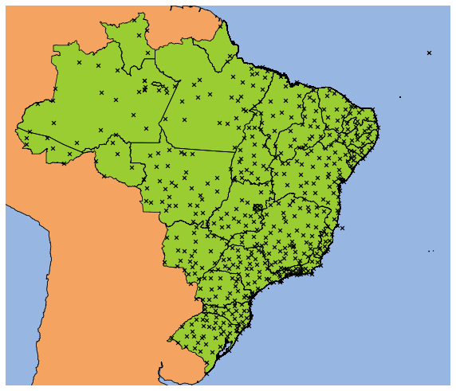


CAICO station: São Pedro e São Paulo Archipelago.

## Dummifying region columns


```python
df = pd.get_dummies(df, columns=['region'], prefix='', prefix_sep='', )
df.reset_index(drop=True, inplace=True)
df.head()
```


<div>
<style scoped>
    .dataframe tbody tr th:only-of-type {
        vertical-align: middle;
    }

    .dataframe tbody tr th {
        vertical-align: top;
    }

    .dataframe thead th {
        text-align: right;
    }
</style>
<table border="1" class="dataframe">
  <thead>
    <tr style="text-align: right;">
      <th></th>
      <th>lat</th>
      <th>lon</th>
      <th>state</th>
      <th>station</th>
      <th>H</th>
      <th>P</th>
      <th>R</th>
      <th>T</th>
      <th>V</th>
      <th>sH</th>
      <th>sP</th>
      <th>sR</th>
      <th>sT</th>
      <th>sV</th>
      <th>CO</th>
      <th>N</th>
      <th>NE</th>
      <th>S</th>
      <th>SE</th>
    </tr>
  </thead>
  <tbody>
    <tr>
      <th>0</th>
      <td>-15.789444</td>
      <td>-47.925833</td>
      <td>RN</td>
      <td>SANTA CRUZ</td>
      <td>65.450729</td>
      <td>887.287915</td>
      <td>113.008965</td>
      <td>21.527390</td>
      <td>2.324405</td>
      <td>16.636954</td>
      <td>2.060525</td>
      <td>56.675536</td>
      <td>3.434736</td>
      <td>1.117212</td>
      <td>0</td>
      <td>0</td>
      <td>1</td>
      <td>0</td>
      <td>0</td>
    </tr>
    <tr>
      <th>1</th>
      <td>-15.599722</td>
      <td>-48.131111</td>
      <td>BA</td>
      <td>BARREIRAS</td>
      <td>63.415417</td>
      <td>888.740947</td>
      <td>131.155556</td>
      <td>21.908385</td>
      <td>2.318807</td>
      <td>15.382483</td>
      <td>1.644735</td>
      <td>44.732468</td>
      <td>3.314155</td>
      <td>1.329252</td>
      <td>0</td>
      <td>0</td>
      <td>1</td>
      <td>0</td>
      <td>0</td>
    </tr>
    <tr>
      <th>2</th>
      <td>-15.939167</td>
      <td>-50.141389</td>
      <td>SP</td>
      <td>ARIRANHA</td>
      <td>62.718272</td>
      <td>954.701575</td>
      <td>111.373788</td>
      <td>25.655920</td>
      <td>1.086215</td>
      <td>16.226072</td>
      <td>1.781967</td>
      <td>69.084993</td>
      <td>4.065550</td>
      <td>1.061130</td>
      <td>0</td>
      <td>0</td>
      <td>0</td>
      <td>0</td>
      <td>1</td>
    </tr>
    <tr>
      <th>3</th>
      <td>-3.103333</td>
      <td>-60.016389</td>
      <td>RS</td>
      <td>BAGE</td>
      <td>74.779010</td>
      <td>1004.262176</td>
      <td>167.319125</td>
      <td>27.768980</td>
      <td>1.452776</td>
      <td>13.432962</td>
      <td>2.381811</td>
      <td>69.886715</td>
      <td>2.598391</td>
      <td>0.799783</td>
      <td>0</td>
      <td>0</td>
      <td>0</td>
      <td>1</td>
      <td>0</td>
    </tr>
    <tr>
      <th>4</th>
      <td>-6.650278</td>
      <td>-69.866944</td>
      <td>PR</td>
      <td>VENTANIA</td>
      <td>70.680097</td>
      <td>997.946723</td>
      <td>185.486389</td>
      <td>25.537133</td>
      <td>0.782401</td>
      <td>13.597679</td>
      <td>2.583953</td>
      <td>77.443203</td>
      <td>3.126108</td>
      <td>0.804853</td>
      <td>0</td>
      <td>0</td>
      <td>0</td>
      <td>1</td>
      <td>0</td>
    </tr>
  </tbody>
</table>
</div>


```python
coord_cols = ['lon', 'lat']
dsc_cols = ['state', 'station']
cat_cols = ['NE', 'N', 'CO', 'S', 'SE']
num_cols = [c for c in df.columns if c not in (lat_lon+dsc_cols+cat_cols)]
```


```python
coords = df[lat_lon]
X_num = df[num_cols]
X_cat = df[cat_cols]

X_num.head()
```


<div>
<style scoped>
    .dataframe tbody tr th:only-of-type {
        vertical-align: middle;
    }

    .dataframe tbody tr th {
        vertical-align: top;
    }

    .dataframe thead th {
        text-align: right;
    }
</style>
<table border="1" class="dataframe">
  <thead>
    <tr style="text-align: right;">
      <th></th>
      <th>H</th>
      <th>P</th>
      <th>R</th>
      <th>T</th>
      <th>V</th>
      <th>sH</th>
      <th>sP</th>
      <th>sR</th>
      <th>sT</th>
      <th>sV</th>
    </tr>
  </thead>
  <tbody>
    <tr>
      <th>0</th>
      <td>65.450729</td>
      <td>887.287915</td>
      <td>113.008965</td>
      <td>21.527390</td>
      <td>2.324405</td>
      <td>16.636954</td>
      <td>2.060525</td>
      <td>56.675536</td>
      <td>3.434736</td>
      <td>1.117212</td>
    </tr>
    <tr>
      <th>1</th>
      <td>63.415417</td>
      <td>888.740947</td>
      <td>131.155556</td>
      <td>21.908385</td>
      <td>2.318807</td>
      <td>15.382483</td>
      <td>1.644735</td>
      <td>44.732468</td>
      <td>3.314155</td>
      <td>1.329252</td>
    </tr>
    <tr>
      <th>2</th>
      <td>62.718272</td>
      <td>954.701575</td>
      <td>111.373788</td>
      <td>25.655920</td>
      <td>1.086215</td>
      <td>16.226072</td>
      <td>1.781967</td>
      <td>69.084993</td>
      <td>4.065550</td>
      <td>1.061130</td>
    </tr>
    <tr>
      <th>3</th>
      <td>74.779010</td>
      <td>1004.262176</td>
      <td>167.319125</td>
      <td>27.768980</td>
      <td>1.452776</td>
      <td>13.432962</td>
      <td>2.381811</td>
      <td>69.886715</td>
      <td>2.598391</td>
      <td>0.799783</td>
    </tr>
    <tr>
      <th>4</th>
      <td>70.680097</td>
      <td>997.946723</td>
      <td>185.486389</td>
      <td>25.537133</td>
      <td>0.782401</td>
      <td>13.597679</td>
      <td>2.583953</td>
      <td>77.443203</td>
      <td>3.126108</td>
      <td>0.804853</td>
    </tr>
  </tbody>
</table>
</div>


```python
scaler = StandardScaler()
X_num_sc = scaler.fit_transform(X_num)
X_num_sc = pd.DataFrame(X_num_sc, columns=X_num.columns)
X_num_sc.head()
```


<div>
<style scoped>
    .dataframe tbody tr th:only-of-type {
        vertical-align: middle;
    }

    .dataframe tbody tr th {
        vertical-align: top;
    }

    .dataframe thead th {
        text-align: right;
    }
</style>
<table border="1" class="dataframe">
  <thead>
    <tr style="text-align: right;">
      <th></th>
      <th>H</th>
      <th>P</th>
      <th>R</th>
      <th>T</th>
      <th>V</th>
      <th>sH</th>
      <th>sP</th>
      <th>sR</th>
      <th>sT</th>
      <th>sV</th>
    </tr>
  </thead>
  <tbody>
    <tr>
      <th>0</th>
      <td>-0.859100</td>
      <td>-2.119518</td>
      <td>0.243202</td>
      <td>-0.656529</td>
      <td>0.344526</td>
      <td>0.451254</td>
      <td>-0.277475</td>
      <td>-0.418074</td>
      <td>-0.399973</td>
      <td>-0.314016</td>
    </tr>
    <tr>
      <th>1</th>
      <td>-1.115694</td>
      <td>-2.080964</td>
      <td>0.681733</td>
      <td>-0.538497</td>
      <td>0.338640</td>
      <td>-0.039444</td>
      <td>-0.642855</td>
      <td>-0.990809</td>
      <td>-0.562896</td>
      <td>0.259466</td>
    </tr>
    <tr>
      <th>2</th>
      <td>-1.203584</td>
      <td>-0.330812</td>
      <td>0.203686</td>
      <td>0.622482</td>
      <td>-0.957326</td>
      <td>0.290533</td>
      <td>-0.522261</td>
      <td>0.177027</td>
      <td>0.452350</td>
      <td>-0.465696</td>
    </tr>
    <tr>
      <th>3</th>
      <td>0.316927</td>
      <td>0.984194</td>
      <td>1.555663</td>
      <td>1.277104</td>
      <td>-0.571918</td>
      <td>-0.802018</td>
      <td>0.004858</td>
      <td>0.215473</td>
      <td>-1.530000</td>
      <td>-1.172534</td>
    </tr>
    <tr>
      <th>4</th>
      <td>-0.199828</td>
      <td>0.816624</td>
      <td>1.994694</td>
      <td>0.585682</td>
      <td>-1.276761</td>
      <td>-0.737588</td>
      <td>0.182493</td>
      <td>0.577848</td>
      <td>-0.816975</td>
      <td>-1.158821</td>
    </tr>
  </tbody>
</table>
</div>


```python
X_num_sc
```


<div>
<style scoped>
    .dataframe tbody tr th:only-of-type {
        vertical-align: middle;
    }

    .dataframe tbody tr th {
        vertical-align: top;
    }

    .dataframe thead th {
        text-align: right;
    }
</style>
<table border="1" class="dataframe">
  <thead>
    <tr style="text-align: right;">
      <th></th>
      <th>H</th>
      <th>P</th>
      <th>R</th>
      <th>T</th>
      <th>V</th>
      <th>sH</th>
      <th>sP</th>
      <th>sR</th>
      <th>sT</th>
      <th>sV</th>
    </tr>
  </thead>
  <tbody>
    <tr>
      <th>0</th>
      <td>-0.859100</td>
      <td>-2.119518</td>
      <td>0.243202</td>
      <td>-0.656529</td>
      <td>0.344526</td>
      <td>0.451254</td>
      <td>-0.277475</td>
      <td>-0.418074</td>
      <td>-0.399973</td>
      <td>-0.314016</td>
    </tr>
    <tr>
      <th>1</th>
      <td>-1.115694</td>
      <td>-2.080964</td>
      <td>0.681733</td>
      <td>-0.538497</td>
      <td>0.338640</td>
      <td>-0.039444</td>
      <td>-0.642855</td>
      <td>-0.990809</td>
      <td>-0.562896</td>
      <td>0.259466</td>
    </tr>
    <tr>
      <th>2</th>
      <td>-1.203584</td>
      <td>-0.330812</td>
      <td>0.203686</td>
      <td>0.622482</td>
      <td>-0.957326</td>
      <td>0.290533</td>
      <td>-0.522261</td>
      <td>0.177027</td>
      <td>0.452350</td>
      <td>-0.465696</td>
    </tr>
    <tr>
      <th>3</th>
      <td>0.316927</td>
      <td>0.984194</td>
      <td>1.555663</td>
      <td>1.277104</td>
      <td>-0.571918</td>
      <td>-0.802018</td>
      <td>0.004858</td>
      <td>0.215473</td>
      <td>-1.530000</td>
      <td>-1.172534</td>
    </tr>
    <tr>
      <th>4</th>
      <td>-0.199828</td>
      <td>0.816624</td>
      <td>1.994694</td>
      <td>0.585682</td>
      <td>-1.276761</td>
      <td>-0.737588</td>
      <td>0.182493</td>
      <td>0.577848</td>
      <td>-0.816975</td>
      <td>-1.158821</td>
    </tr>
    <tr>
      <th>...</th>
      <td>...</td>
      <td>...</td>
      <td>...</td>
      <td>...</td>
      <td>...</td>
      <td>...</td>
      <td>...</td>
      <td>...</td>
      <td>...</td>
      <td>...</td>
    </tr>
    <tr>
      <th>556</th>
      <td>1.268879</td>
      <td>0.537686</td>
      <td>1.878261</td>
      <td>0.605842</td>
      <td>-1.092457</td>
      <td>-0.743612</td>
      <td>-0.129558</td>
      <td>0.019685</td>
      <td>-0.826425</td>
      <td>-1.065737</td>
    </tr>
    <tr>
      <th>557</th>
      <td>1.273288</td>
      <td>0.535748</td>
      <td>0.439134</td>
      <td>0.580666</td>
      <td>-0.658392</td>
      <td>-0.696672</td>
      <td>-0.083038</td>
      <td>2.096679</td>
      <td>-0.620182</td>
      <td>-0.911984</td>
    </tr>
    <tr>
      <th>558</th>
      <td>0.511917</td>
      <td>0.444931</td>
      <td>0.090893</td>
      <td>0.579791</td>
      <td>-0.508183</td>
      <td>-0.910329</td>
      <td>-0.128260</td>
      <td>0.614093</td>
      <td>-0.487119</td>
      <td>-0.690716</td>
    </tr>
    <tr>
      <th>559</th>
      <td>1.488055</td>
      <td>0.682439</td>
      <td>1.542413</td>
      <td>0.537639</td>
      <td>-0.623750</td>
      <td>-0.913525</td>
      <td>-0.129164</td>
      <td>0.998415</td>
      <td>-0.596789</td>
      <td>-0.743686</td>
    </tr>
    <tr>
      <th>560</th>
      <td>1.197882</td>
      <td>0.524749</td>
      <td>0.596082</td>
      <td>0.324406</td>
      <td>-1.091953</td>
      <td>-0.416265</td>
      <td>0.804788</td>
      <td>0.154000</td>
      <td>-0.095601</td>
      <td>-1.480717</td>
    </tr>
  </tbody>
</table>
<p>561 rows × 10 columns</p>
</div>


## Looking at variables


```python
extents = {}
extents['left'] = -75
extents['right'] = -31
extents['bottom'] = -35
extents['top'] = 6
extents_tuple = [extents[d] for d in ['left', 'right', 'bottom', 'top']]
extents
```


    {'left': -75, 'right': -31, 'bottom': -35, 'top': 6}


```python
variables = ['T', 'H', 'P', 'R', 'V']
stds = ['s' + c for c in variables]

T, H, P, R, V = [df[[c for c in df.columns if c.startswith(var)]].mean(axis=1)
                 for var in variables]
sT, sH, sP, sR, sV = [df[[c for c in df.columns if c.startswith(var)]].mean(axis=1)
                      for var in stds]
```


```python
def knn_map(coords, labels, extents=None, div=None,
            k=6, weighted=True,
            cmap=None, n_cmap=None, vmin=None, vmax=None,
            scat_coords=True, marker='o', ms=11, mec='black', mfc='black',
            title=None, cbar_label=None,
            projection=crs.PlateCarree(),
            fig=None, ax=None, figsize=(8,8),
            add_cbar=True, label_names=None):
    
    def get_n_lon_lat(div):
        if div is None:
            n_lon = n_lat = 200
        elif isinstance(div, int):
            n_lon = n_lat = div
        else:
            n_lon, n_lat = div
        return n_lon, n_lat
    
    def get_extents(extents):
        if isinstance(extents, dict):
            pass
        elif extents is None:
            extents = {'left':-180, 'right':180, 'bottom':-90, 'top':90}
        else:
            extents = {lim: extents[i] for i, lim in
                       enumerate(['left', 'right', 'bottom', 'top'])}
        return extents
    
    coords = np.asarray(coords)
    labels = np.asarray(labels)
    extents = get_extents(extents)
    extents_tuple = [extents[lim] for lim in ['left', 'right', 'bottom', 'top']]
    n_lon, n_lat = get_n_lon_lat(div)
    
    lon_int_ax = np.linspace(extents['left'], extents['right'], n_lon)
    lat_int_ax = np.linspace(extents['bottom'], extents['top'], n_lat)
    lon_int_grid, lat_int_grid = np.meshgrid(lon_int_ax, lat_int_ax)
    coords_int = np.stack([arr.ravel()
                           for arr in (lon_int_grid, lat_int_grid)],
                          axis=1)

    weights = 'distance' if weighted else 'uniform'
    try:
        knn = KNeighborsClassifier(n_neighbors=k, weights=weights)
        knn.fit(coords, labels)
        n_classes = knn.classes_.size
        cmap = mpl.cm.get_cmap(cmap, n_classes)
    except ValueError:
        knn = KNeighborsRegressor(n_neighbors=k, weights=weights)
        knn.fit(coords, labels)
        n_classes = None
        cmap = mpl.cm.get_cmap(cmap, n_cmap)
         
    labels_int = knn.predict(coords_int)
    
    mask = ~contains(brazil_shapes[0],
                     coords_int[:,0],
                     coords_int[:,1])
    
    masked = np.ma.masked_array(labels_int, mask)
    masked_grid = masked.reshape((n_lon, n_lat))

    if ax is None:
        if fig is None:
            fig = plt.figure(figsize=figsize)
        ax = fig.add_subplot(111, projection=projection)

    ax.add_feature(cfeature.OCEAN, zorder=0)
    ax.add_feature(cfeature.LAND, zorder=1, fc='sandybrown', ec='black')
    ax.add_geometries(states_shapes, projection, zorder=3, fc='none', ec='black')
    
    pcol = ax.pcolormesh(lon_int_grid, lat_int_grid, masked_grid,
                         zorder=2, cmap=cmap, vmin=vmin, vmax=vmax)
    
    if add_cbar:
        if n_classes is not None:
            boundaries = np.arange(0, n_classes+1)
            values = boundaries[:-1]
            ticks = values + 0.5
            cbar = plt.colorbar(pcol,
                                ax=ax,
                                boundaries=boundaries,
                                orientation='horizontal',
                                values=values,
                                ticks=boundaries)
            cbar.set_ticks(ticks)
            if label_names:
                cbar.set_ticklabels(label_names)
            else:
                cbar.set_ticklabels(knn.classes_)
        else:
            cbar = plt.colorbar(pcol, ax=ax, orientation='horizontal')

        if cbar_label is not None:
            cbar.set_label(cbar_label)
    if title is not None:
        ax.set_title(title)
    if scat_coords:
        if n_classes is not None:
            for c in knn.classes_:
                c_idx = labels==c
                ax.scatter(coords[c_idx,0], coords[c_idx,1], zorder=4,
                           marker=marker, s=ms, alpha=.4,
                           ec=mec, fc=cmap(c/n_classes))
        else:
            ax.scatter(coords[:,0], coords[:,1], zorder=4,
                       marker=marker, s=ms, alpha=.4,
                       ec=mec, fc=mfc)
    ax.set_extent(extents_tuple, projection)
    
    gl = ax.gridlines(crs=projection, draw_labels=True,
                      linewidth=1, color='white', alpha=.2, linestyle='--')
```

### Creating a good colormap for pressure 


```python
# low pressure <--> clouds; high pressure <--> open sky
# low pressure <--> greys; high pressure <--> blues
N = 200
blues = mpl.cm.Blues(np.linspace(0,1, N))
greys_r = mpl.cm.Greys_r(np.linspace(0,1, N))
grey_blue = np.concatenate([greys_r, blues])
grey_blue = mpl.colors.ListedColormap(grey_blue)
```


```python
fig, axes = plt.subplots(2, 3, figsize=(14,10), subplot_kw={'projection':projection})

knn_map(coords, T, extents, ax=axes.flat[0], cbar_label=r'Temperature ($^{\circ}C$)', cmap='RdBu_r')
knn_map(coords, H, extents, ax=axes.flat[1], cbar_label=r'Humidity (%)', cmap='Spectral')
knn_map(coords, P, extents, ax=axes.flat[2], cbar_label=r'Pressure (mB)', cmap=grey_blue)
knn_map(coords, R, extents, ax=axes.flat[3], cbar_label=r'Precipitation (mm)', cmap='Blues')
knn_map(coords, V, extents, ax=axes.flat[4], cbar_label=r'Wind (m/s)', cmap='viridis')
axes.flat[-1].remove()
```


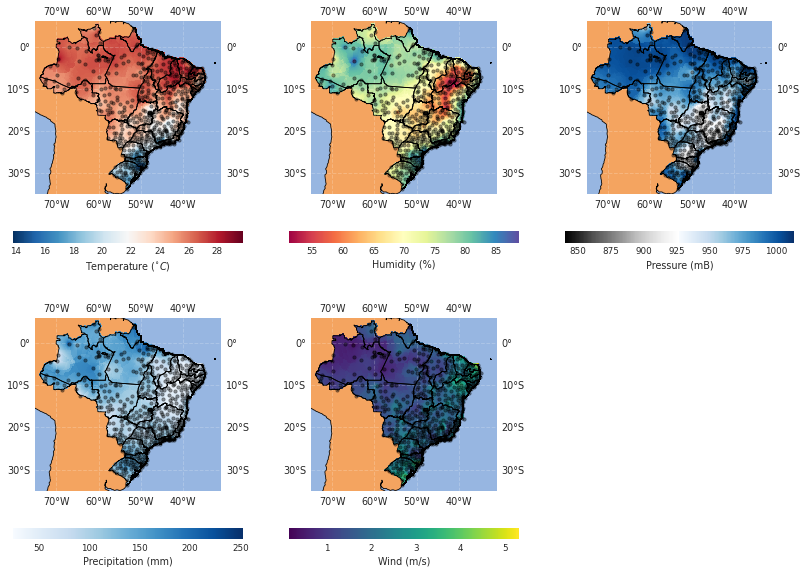


```python
fig, axes = plt.subplots(2,3, figsize=(14,10), subplot_kw={'projection':projection})
scmap = 'plasma'
knn_map(coords, sT, extents, ax=axes.flat[0], cbar_label=r'Temperature ($^{\circ}C$)', cmap=scmap)
knn_map(coords, sH, extents, ax=axes.flat[1], cbar_label=r'Humidity (%)', cmap=scmap)
knn_map(coords, sP, extents, ax=axes.flat[2], cbar_label=r'Pressure (mB)', cmap=scmap, vmax=6)
knn_map(coords, sR, extents, ax=axes.flat[3], cbar_label=r'Precipitation (mm)', cmap=scmap)
knn_map(coords, sV, extents, ax=axes.flat[4], cbar_label=r'Wind (m/s)', cmap=scmap, vmax=2)
axes.flat[-1].remove()
```


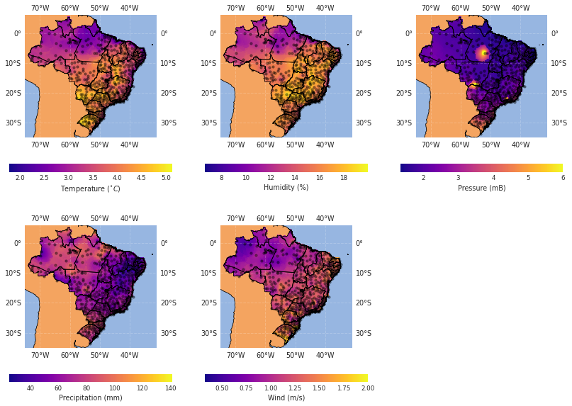


```python
df[df['sP']>6]
```


<div>
<style scoped>
    .dataframe tbody tr th:only-of-type {
        vertical-align: middle;
    }

    .dataframe tbody tr th {
        vertical-align: top;
    }

    .dataframe thead th {
        text-align: right;
    }
</style>
<table border="1" class="dataframe">
  <thead>
    <tr style="text-align: right;">
      <th></th>
      <th>lat</th>
      <th>lon</th>
      <th>state</th>
      <th>station</th>
      <th>H</th>
      <th>P</th>
      <th>R</th>
      <th>T</th>
      <th>V</th>
      <th>sH</th>
      <th>sP</th>
      <th>sR</th>
      <th>sT</th>
      <th>sV</th>
      <th>CO</th>
      <th>N</th>
      <th>NE</th>
      <th>S</th>
      <th>SE</th>
    </tr>
  </thead>
  <tbody>
    <tr>
      <th>198</th>
      <td>-6.639722</td>
      <td>-51.956944</td>
      <td>MT</td>
      <td>SAO FELIX  DO ARAGUAIA</td>
      <td>78.815797</td>
      <td>987.867897</td>
      <td>150.508333</td>
      <td>26.198640</td>
      <td>1.588278</td>
      <td>15.884453</td>
      <td>12.501164</td>
      <td>63.103013</td>
      <td>3.499945</td>
      <td>1.064278</td>
      <td>1</td>
      <td>0</td>
      <td>0</td>
      <td>0</td>
      <td>0</td>
    </tr>
    <tr>
      <th>364</th>
      <td>-22.373889</td>
      <td>-44.703056</td>
      <td>MS</td>
      <td>COXIM</td>
      <td>82.125538</td>
      <td>763.268354</td>
      <td>142.672222</td>
      <td>10.703426</td>
      <td>2.847170</td>
      <td>16.117948</td>
      <td>14.873817</td>
      <td>78.407102</td>
      <td>3.436498</td>
      <td>1.593999</td>
      <td>1</td>
      <td>0</td>
      <td>0</td>
      <td>0</td>
      <td>0</td>
    </tr>
    <tr>
      <th>547</th>
      <td>-17.297222</td>
      <td>-54.837222</td>
      <td>RS</td>
      <td>SANTA ROSA</td>
      <td>69.673177</td>
      <td>945.576353</td>
      <td>93.764280</td>
      <td>24.352213</td>
      <td>1.771318</td>
      <td>15.911930</td>
      <td>14.622271</td>
      <td>58.606179</td>
      <td>3.909244</td>
      <td>1.286402</td>
      <td>0</td>
      <td>0</td>
      <td>0</td>
      <td>1</td>
      <td>0</td>
    </tr>
  </tbody>
</table>
</div>


## PCA


```python
pca = PCA()
X_pca_full = pca.fit_transform(X_num_sc)
X_pca_full = pd.DataFrame(X_pca_full, columns=np.arange(1, X_num.columns.size+1))
X_pca_full.head()
```


<div>
<style scoped>
    .dataframe tbody tr th:only-of-type {
        vertical-align: middle;
    }

    .dataframe tbody tr th {
        vertical-align: top;
    }

    .dataframe thead th {
        text-align: right;
    }
</style>
<table border="1" class="dataframe">
  <thead>
    <tr style="text-align: right;">
      <th></th>
      <th>1</th>
      <th>2</th>
      <th>3</th>
      <th>4</th>
      <th>5</th>
      <th>6</th>
      <th>7</th>
      <th>8</th>
      <th>9</th>
      <th>10</th>
    </tr>
  </thead>
  <tbody>
    <tr>
      <th>0</th>
      <td>-0.847106</td>
      <td>0.981557</td>
      <td>-0.052871</td>
      <td>-1.698452</td>
      <td>0.598127</td>
      <td>1.091698</td>
      <td>-0.507021</td>
      <td>-0.145552</td>
      <td>0.247912</td>
      <td>-0.308904</td>
    </tr>
    <tr>
      <th>1</th>
      <td>-0.873402</td>
      <td>0.710085</td>
      <td>0.442283</td>
      <td>-1.934483</td>
      <td>0.516722</td>
      <td>1.030901</td>
      <td>-1.189185</td>
      <td>0.338872</td>
      <td>-0.247735</td>
      <td>-0.316662</td>
    </tr>
    <tr>
      <th>2</th>
      <td>-0.673966</td>
      <td>-0.644175</td>
      <td>-1.163536</td>
      <td>-0.506441</td>
      <td>-0.688486</td>
      <td>0.752904</td>
      <td>-0.071223</td>
      <td>0.400870</td>
      <td>-0.164245</td>
      <td>-0.019472</td>
    </tr>
    <tr>
      <th>3</th>
      <td>2.021792</td>
      <td>-1.957614</td>
      <td>-0.381864</td>
      <td>0.140697</td>
      <td>-0.009066</td>
      <td>0.539183</td>
      <td>-1.066104</td>
      <td>-0.219245</td>
      <td>0.422579</td>
      <td>-0.336370</td>
    </tr>
    <tr>
      <th>4</th>
      <td>2.036194</td>
      <td>-1.260124</td>
      <td>-1.246281</td>
      <td>0.146786</td>
      <td>-0.392069</td>
      <td>0.878067</td>
      <td>-0.962455</td>
      <td>0.153971</td>
      <td>-0.233987</td>
      <td>-0.584855</td>
    </tr>
  </tbody>
</table>
</div>


```python
plt.figure(figsize=(7,7))
plt.xlabel('$1^{st}$ principal component')
plt.ylabel('$2^{nd}$ principal component')
plt.scatter(X_pca_full[1], X_pca_full[2], marker='.')
```


    <matplotlib.collections.PathCollection at 0x7f77b8165290>


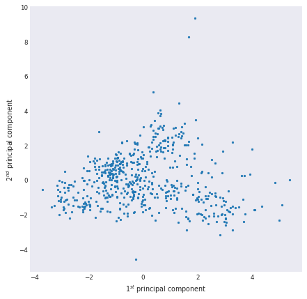


```python
plt.figure(figsize=(15,4))
plt.subplot(121)
plt.plot(X_pca_full.columns, pca.explained_variance_ratio_, marker='o')
plt.xticks(X_pca_full.columns)
plt.title('Variance (%)')
plt.xlabel('Principal component')
plt.ylabel('%')
plt.grid()
plt.subplot(122)
plt.plot(X_pca_full.columns, np.cumsum(pca.explained_variance_ratio_), marker='o')
plt.xticks(X_pca_full.columns)
plt.title('Accumulated Variance (%)')
plt.xlabel('Principal component')
plt.ylabel('%')
plt.grid()
plt.tight_layout()
```


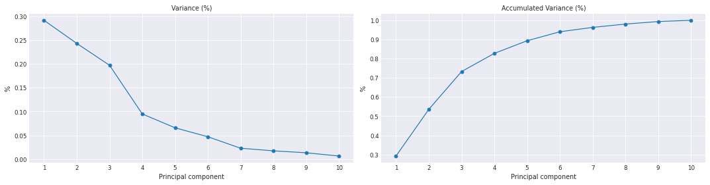


Taking **90% of variance** with **5 components**:


```python
fig,axes = plt.subplots(figsize=(16,5))

n_components = 5

X_all = pd.concat([X_num_sc, X_pca_full], axis=1)
corr = X_all.corr()
abscorr = np.abs(corr)

resp = abscorr.copy()
for i in X_pca_full.columns:
    resp.loc[i,:] /= np.sum(abscorr.loc[i,:])

sns.heatmap(
    abscorr.loc[X_pca_full.columns[:n_components], X_num.columns],
#     resp.loc[X_pca_full.columns[:n_components], X_num.columns],
    annot=True, fmt='.0%',
    cmap='Greys',
    linewidths=3,
)

plt.tight_layout()
```


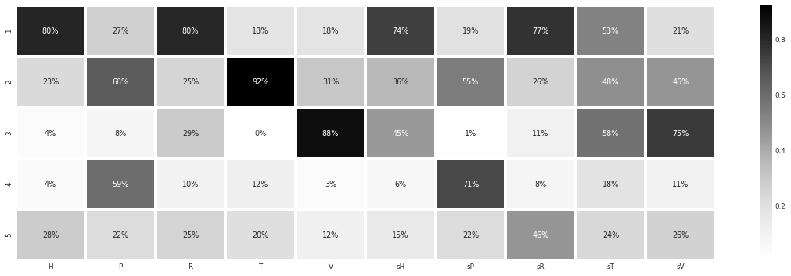


```python
X_pca = X_pca_full.loc[:,:5]
X_pca.head()
```


<div>
<style scoped>
    .dataframe tbody tr th:only-of-type {
        vertical-align: middle;
    }

    .dataframe tbody tr th {
        vertical-align: top;
    }

    .dataframe thead th {
        text-align: right;
    }
</style>
<table border="1" class="dataframe">
  <thead>
    <tr style="text-align: right;">
      <th></th>
      <th>1</th>
      <th>2</th>
      <th>3</th>
      <th>4</th>
      <th>5</th>
    </tr>
  </thead>
  <tbody>
    <tr>
      <th>0</th>
      <td>-0.847106</td>
      <td>0.981557</td>
      <td>-0.052871</td>
      <td>-1.698452</td>
      <td>0.598127</td>
    </tr>
    <tr>
      <th>1</th>
      <td>-0.873402</td>
      <td>0.710085</td>
      <td>0.442283</td>
      <td>-1.934483</td>
      <td>0.516722</td>
    </tr>
    <tr>
      <th>2</th>
      <td>-0.673966</td>
      <td>-0.644175</td>
      <td>-1.163536</td>
      <td>-0.506441</td>
      <td>-0.688486</td>
    </tr>
    <tr>
      <th>3</th>
      <td>2.021792</td>
      <td>-1.957614</td>
      <td>-0.381864</td>
      <td>0.140697</td>
      <td>-0.009066</td>
    </tr>
    <tr>
      <th>4</th>
      <td>2.036194</td>
      <td>-1.260124</td>
      <td>-1.246281</td>
      <td>0.146786</td>
      <td>-0.392069</td>
    </tr>
  </tbody>
</table>
</div>


```python
pca_cols = [*X_pca.columns]
df[pca_cols] = X_pca
df.head()
```


<div>
<style scoped>
    .dataframe tbody tr th:only-of-type {
        vertical-align: middle;
    }

    .dataframe tbody tr th {
        vertical-align: top;
    }

    .dataframe thead th {
        text-align: right;
    }
</style>
<table border="1" class="dataframe">
  <thead>
    <tr style="text-align: right;">
      <th></th>
      <th>lat</th>
      <th>lon</th>
      <th>state</th>
      <th>station</th>
      <th>H</th>
      <th>P</th>
      <th>R</th>
      <th>T</th>
      <th>V</th>
      <th>sH</th>
      <th>...</th>
      <th>CO</th>
      <th>N</th>
      <th>NE</th>
      <th>S</th>
      <th>SE</th>
      <th>1</th>
      <th>2</th>
      <th>3</th>
      <th>4</th>
      <th>5</th>
    </tr>
  </thead>
  <tbody>
    <tr>
      <th>0</th>
      <td>-15.789444</td>
      <td>-47.925833</td>
      <td>RN</td>
      <td>SANTA CRUZ</td>
      <td>65.450729</td>
      <td>887.287915</td>
      <td>113.008965</td>
      <td>21.527390</td>
      <td>2.324405</td>
      <td>16.636954</td>
      <td>...</td>
      <td>0</td>
      <td>0</td>
      <td>1</td>
      <td>0</td>
      <td>0</td>
      <td>-0.847106</td>
      <td>0.981557</td>
      <td>-0.052871</td>
      <td>-1.698452</td>
      <td>0.598127</td>
    </tr>
    <tr>
      <th>1</th>
      <td>-15.599722</td>
      <td>-48.131111</td>
      <td>BA</td>
      <td>BARREIRAS</td>
      <td>63.415417</td>
      <td>888.740947</td>
      <td>131.155556</td>
      <td>21.908385</td>
      <td>2.318807</td>
      <td>15.382483</td>
      <td>...</td>
      <td>0</td>
      <td>0</td>
      <td>1</td>
      <td>0</td>
      <td>0</td>
      <td>-0.873402</td>
      <td>0.710085</td>
      <td>0.442283</td>
      <td>-1.934483</td>
      <td>0.516722</td>
    </tr>
    <tr>
      <th>2</th>
      <td>-15.939167</td>
      <td>-50.141389</td>
      <td>SP</td>
      <td>ARIRANHA</td>
      <td>62.718272</td>
      <td>954.701575</td>
      <td>111.373788</td>
      <td>25.655920</td>
      <td>1.086215</td>
      <td>16.226072</td>
      <td>...</td>
      <td>0</td>
      <td>0</td>
      <td>0</td>
      <td>0</td>
      <td>1</td>
      <td>-0.673966</td>
      <td>-0.644175</td>
      <td>-1.163536</td>
      <td>-0.506441</td>
      <td>-0.688486</td>
    </tr>
    <tr>
      <th>3</th>
      <td>-3.103333</td>
      <td>-60.016389</td>
      <td>RS</td>
      <td>BAGE</td>
      <td>74.779010</td>
      <td>1004.262176</td>
      <td>167.319125</td>
      <td>27.768980</td>
      <td>1.452776</td>
      <td>13.432962</td>
      <td>...</td>
      <td>0</td>
      <td>0</td>
      <td>0</td>
      <td>1</td>
      <td>0</td>
      <td>2.021792</td>
      <td>-1.957614</td>
      <td>-0.381864</td>
      <td>0.140697</td>
      <td>-0.009066</td>
    </tr>
    <tr>
      <th>4</th>
      <td>-6.650278</td>
      <td>-69.866944</td>
      <td>PR</td>
      <td>VENTANIA</td>
      <td>70.680097</td>
      <td>997.946723</td>
      <td>185.486389</td>
      <td>25.537133</td>
      <td>0.782401</td>
      <td>13.597679</td>
      <td>...</td>
      <td>0</td>
      <td>0</td>
      <td>0</td>
      <td>1</td>
      <td>0</td>
      <td>2.036194</td>
      <td>-1.260124</td>
      <td>-1.246281</td>
      <td>0.146786</td>
      <td>-0.392069</td>
    </tr>
  </tbody>
</table>
<p>5 rows × 24 columns</p>
</div>


# Cluster Analysis

## KMeans with 3 clusters


```python
km = KMeans(n_clusters=3)
labels = km.fit_predict(X_num_sc)

colors = [f'C{c}' for c in range(km.n_clusters)]
names = list(range(km.n_clusters))

plt.figure(figsize=(7,7))
plt.xlabel('$1^{st}$ principal component')
plt.ylabel('$2^{nd}$ principal component')
for label, (name, color) in enumerate(zip(names, colors)):
    indices = labels==label
    _X_pca = X_pca_clip[indices]
    plt.scatter(_X_pca.loc[:,1], _X_pca.loc[:,2], c=color,  label=name, marker='o')
plt.legend()
```


    <matplotlib.legend.Legend at 0x7f77be15d910>


```python
km = KMeans(n_clusters=3)
labels = km.fit_predict(X_pca)

colors = [f'C{c}' for c in range(km.n_clusters)]
names = list(range(km.n_clusters))

plt.figure(figsize=(7,7))
plt.xlabel('$1^{st}$ principal component')
plt.ylabel('$2^{nd}$ principal component')
for label, (name, color) in enumerate(zip(names, colors)):
    indices = labels==label
    _X_pca = X_pca_clip[indices]
    plt.scatter(_X_pca.loc[:,1], _X_pca.loc[:,2], c=color,  label=name, marker='o')
plt.legend()
```


    <matplotlib.legend.Legend at 0x7f77b7c210d0>


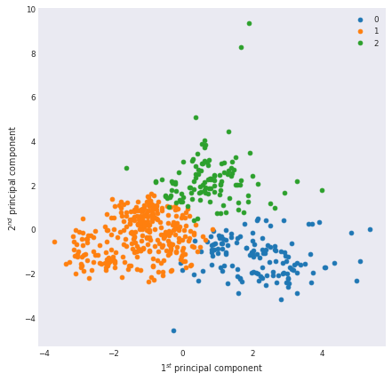


## Testing for some other values of K

### Original dataset


```python
fig, axes = plt.subplots(3, 3, figsize=(10,10), sharex=True, sharey=True)

for k, ax in enumerate(axes.flat, start=3):
    km = KMeans(n_clusters=k)
    labels = km.fit_predict(X_num_sc)
    for label in range(k):
        indices = labels==label
        _X_pca = X_pca_clip[indices]
        ax.scatter(_X_pca.loc[:,1], _X_pca.loc[:,2],
                   c=f"C{label}", label=name, marker='.')
    ax.set_title(f'k = {k}')
    
for i in range(3):
    axes[2,i].set_xlabel('$1^{st}$ principal component')
    axes[i,0].set_ylabel('$2^{nd}$ principal component')
    
plt.tight_layout()
```


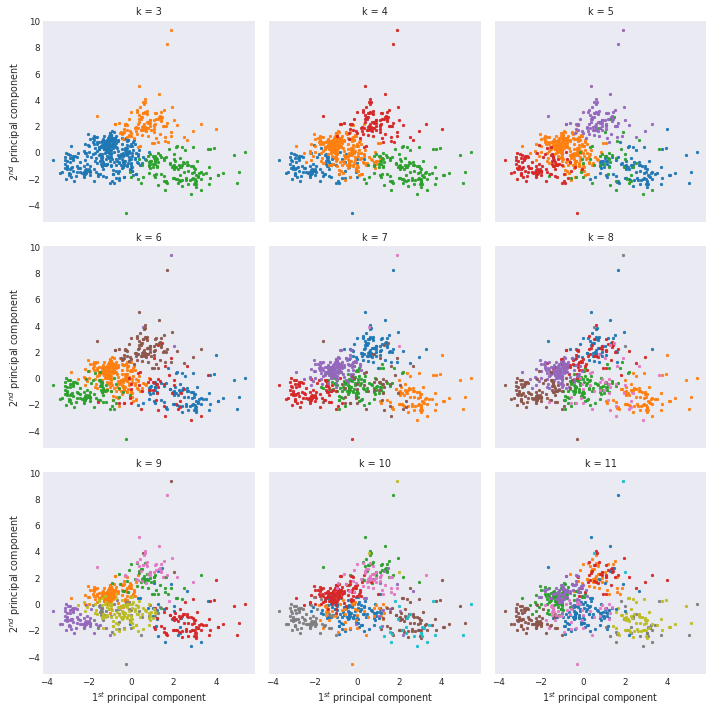


### PCA domain


```python
fig, axes = plt.subplots(3, 3, figsize=(10,10), sharex=True, sharey=True)

for k, ax in enumerate(axes.flat, start=3):
    km = KMeans(n_clusters=k)
    labels = km.fit_predict(X_pca)
    for label in range(k):
        indices = labels==label
        _X_pca = X_pca_clip[indices]
        ax.scatter(_X_pca.loc[:,1], _X_pca.loc[:,2],
                   c=f"C{label}", label=name, marker='.')
    ax.set_title(f'k = {k}')
    
for i in range(3):
    axes[2,i].set_xlabel('$1^{st}$ principal component')
    axes[i,0].set_ylabel('$2^{nd}$ principal component')
    
plt.tight_layout()
```


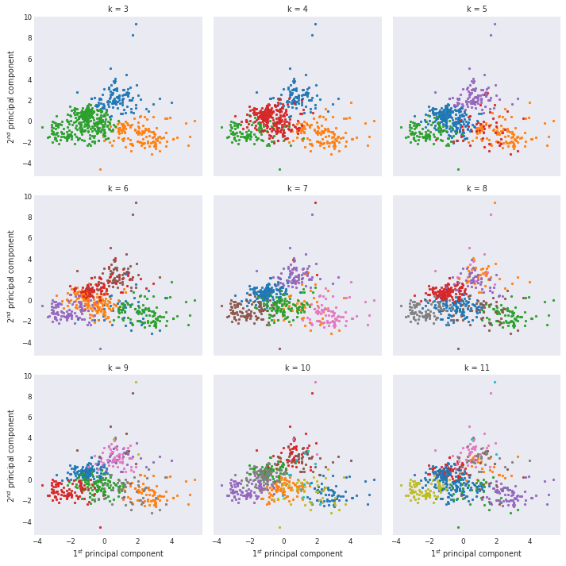


## Intra cluster variance analysis


```python
max_k = 15
range_k = np.arange(2, max_k+1)
var = []
for k in range_k:
    km = KMeans(k)
    km.fit(X_num_sc)
    var.append(km.inertia_)
var = np.asarray(var)
```


```python
plt.xlabel('N. Clusters')
plt.ylabel('Variance')
plt.plot(range_k, var, marker='o')
plt.plot(range_k[[0,-1]], var[[0,-1]])
```


    [<matplotlib.lines.Line2D at 0x7f77afec2450>]


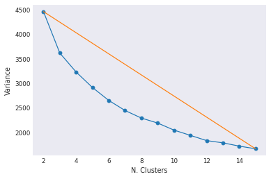


```python
def elbow_distance(x, y=None):
    if y is not None:
        p = np.stack([x, y], 1)
    else:
        p = np.asarray(x)
    ri = p[0]
    rf = p[-1]
    dist = np.abs(np.cross(p-ri,p-rf)/np.linalg.norm(p-ri))
    return dist

dists = elbow_distance(range_k, var)
```


```python
fig, ax = plt.subplots(figsize=(10,5))
ax.plot(range_k, dists, marker='o')
ax.set_xticks(range_k)
ax.plot(range_k[[0, -1]], [0,0])
ax.set_xlabel('N. Clusters')
ax.set_ylabel('Elbow distance')
ax.grid()
```


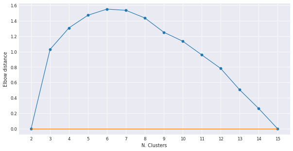


```python
def elbow_analysis(model, X, k_min=2, k_max=15, return_best=False):
    range_k = np.arange(k_min, k_max+1)
    var = np.empty(range_k.shape)
    for i, k in enumerate(range_k):
        var[i] = model(k).fit(X).inertia_
    dist = elbow_distance(range_k, var)
    
     
    fig, axes = plt.subplots(1,2, figsize=(14,4))
    axes[0].set_title(r'Intra-cluster variance $\times$ N. clusters')
    axes[0].set_ylabel('Variance')
    axes[0].plot(range_k, var, marker='o')
    axes[0].plot(range_k[[0,-1]], var[[0,-1]])
    axes[1].set_title(r'Distance $\times$ N. Clusters')
    axes[1].set_ylabel('Elbow distance')
    axes[1].plot(range_k, dist, marker='o')
    axes[1].plot(range_k[[0, -1]], [0,0])
    
    for ax in axes:
        ax.set_xlabel('N. Clusters')
        ax.set_xticks(range_k)
        ax.grid() 
        
    if return_best:
        best_idx = np.argsort(dist)[::-1]
        best = range_k[best_idx[:return_best]]
        return best
```

### Original dataset


```python
elbow_analysis(KMeans, X_num_sc, k_min=2, k_max=20, return_best=4)
```


    array([7, 8, 9, 6])


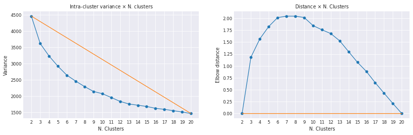


## PCA domain


```python
elbow_analysis(KMeans, X_pca, k_min=2, k_max=20, return_best=4)
```


    array([7, 8, 6, 5])


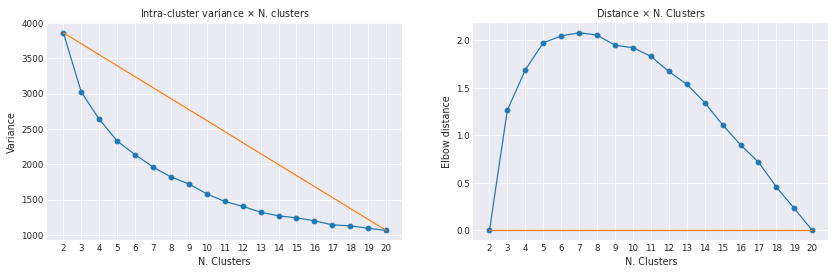


Best results when k equals:
- 5
- 6
- 7
- 8

## Silhouette Analysis


```python
def view_cluster_silhouettes(model, X, k_min=2, k_max=5, cols=3):
    range_k = np.arange(k_min, k_max+1)
    
    plots = range_k.size
    rows = int(np.ceil(plots/cols))
    fig, axes = plt.subplots(rows, cols, figsize=(4*cols,4*rows),
                             sharex=True, squeeze=False)
    for i, k in enumerate(range_k):
        ax = axes.flat[i]
        ax.set_title(f'{k} clusters')
        classes = np.arange(k)
        labels = model(k).fit_predict(X)
        sil = silhouette_samples(X, labels)
        
        mean_sil = sil.mean()
        ax.axvline(mean_sil, c='black', lw=3, alpha=.5,
                   label=f"mean: {mean_sil:.1%}")
         
        pos = np.zeros(2)
        for c in classes:
            sil_c = np.sort(sil[labels==c])
            pos[:] = pos[1], pos[1]+sil_c.size
            ax.barh(np.arange(*pos), sil_c, height=1);
            ax.text(-.05, pos.mean(), str(c))
            
    fig.suptitle('Cluster Silhouettes')
    for ax in axes.flat:
        ax.set_xlabel('Silhouette')
        ax.set_ylabel('Cluster samples')
        ax.set_yticks([])
        ax.legend()
    rm_cols = rows*cols - plots
    for ax in axes[-1, cols-rm_cols:]:
        ax.remove()
```


```python
view_cluster_silhouettes(KMeans, X_num_sc, 2, 9)
```

    No handles with labels found to put in legend.


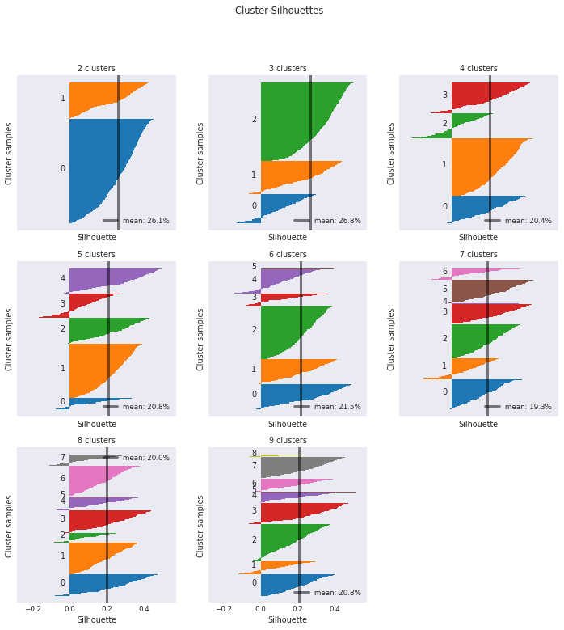


```python
def silhouette(model, X, k_min=2, k_max=5):
    range_k = np.arange(k_min, k_max+1)
    silhouettes = np.empty(range_k.shape)
    for i, k in enumerate(range_k):
        classes = np.arange(k)
        labels = model(k).fit_predict(X)
        silhouettes[i] = silhouette_samples(X, labels).mean()
    return silhouettes
            
    
def plot_silhouette(model, X, k_min=2, k_max=5, samples=5,
                    fig=None, ax=None):
    if ax is None:
        if fig is None:
            fig = plt.figure(figsize=(8,4))
        ax = fig.add_subplot()
        
    range_k = np.arange(k_min, k_max+1)
    
    sils = [silhouette(KMeans, X, k_min, k_max)
            for _ in range(samples)]
    sils = np.stack(sils, axis=1)
    sils_mean = sils.mean(axis=1)
    sils_std = sils.std(axis=1)
    
    ax.errorbar(range_k, sils_mean, sils_std, marker='o')
    ax.set_title(r'Silhouette $\times$ N. clusters')
    ax.set_xlabel('N. clusters')
    ax.set_ylabel('Silhouette')
    ax.set_xticks(range_k)
    ax.grid()
```


```python
plot_silhouette(KMeans, X_num_sc, 2, 20)
```


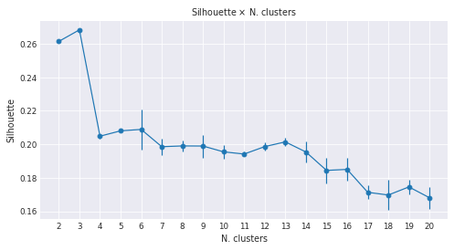


Best results:
- 3
- 5

### Results


```python
ks = [3,4,5,6,7,8,9]
labels = []
label_names = []
for k in ks:
    km = KMeans(k)
    km.fit(X_num_sc)
    labels.append(km.predict(X_num_sc))
    label_names.append(ABC[:k])
```


```python
fig, axes = plt.subplots(2,3, figsize=(14,10), subplot_kw={'projection':projection})

for i, ax in enumerate(axes.flat):
    k = ks[i]
    knn_map(coords, labels[i], extents, k=6,
            title=f'k = {k}', ax=axes.flat[i],
            cmap='tab10', label_names=label_names[i],)
# axes.flat[-1].remove()
```


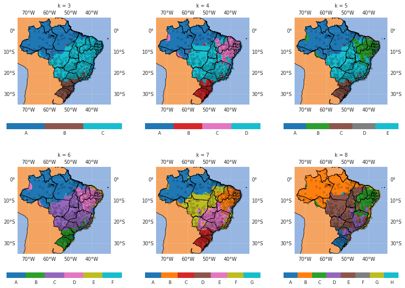


```python
ks = [3,5,6,7]
labels = []
label_names = []
for k in ks:
    labels.append(KMeans(k).fit_predict(X_num_sc))
    label_names.append(ABC[:k])
```


```python
fig, axes = plt.subplots(2,2, figsize=(14,10), subplot_kw={'projection': projection})

for i, ax in enumerate(axes.flat):
    k = ks[i]
    knn_map(coords, labels[i], extents, k=6,
            title=f'k = {k}', ax=axes.flat[i],
            cmap='tab10', label_names=label_names[i],)
# axes.flat[-1].remove()
```


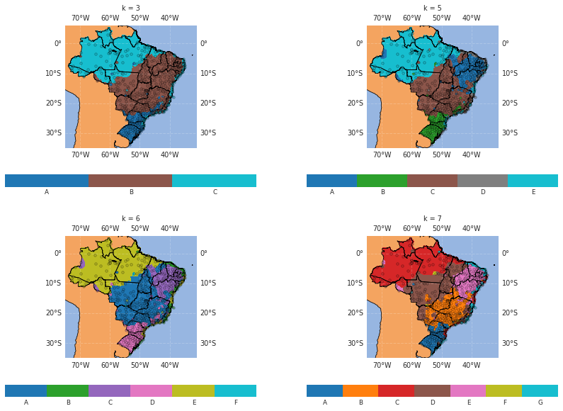


```python
ks = [3,5,6,7]
labels = []
label_names = []
for k in ks:
    labels.append(KMeans(k).fit_predict(X_pca))
    label_names.append(ABC[:k])
```


```python
fig, axes = plt.subplots(2,2, figsize=(14,10), subplot_kw={'projection':projection})

for i, ax in enumerate(axes.flat):
    k = ks[i]
    knn_map(coords, labels[i], extents, k=6,
            title=f'k = {k}', ax=axes.flat[i],
            cmap='tab10', label_names=label_names[i],)
# axes.flat[-1].remove()
```


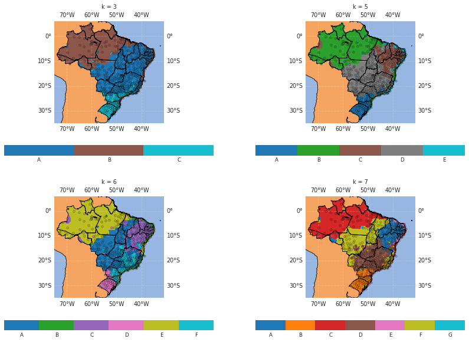


## Cluster characteristics


```python
k = 3
kmdf = df.copy()
kmdf['label'] = KMeans(k).fit_predict(X_num_sc)
knn_map(coords, kmdf['label'], extents, k=6,
        title=f'k = {k}', cmap='tab10', label_names=ABC[:k],)
kmdf['label'] = kmdf['label'].apply(lambda i: ABC[i])
table = kmdf.groupby('label').mean()[num_cols]
table
```


<div>
<style scoped>
    .dataframe tbody tr th:only-of-type {
        vertical-align: middle;
    }

    .dataframe tbody tr th {
        vertical-align: top;
    }

    .dataframe thead th {
        text-align: right;
    }
</style>
<table border="1" class="dataframe">
  <thead>
    <tr style="text-align: right;">
      <th></th>
      <th>H</th>
      <th>P</th>
      <th>R</th>
      <th>T</th>
      <th>V</th>
      <th>sH</th>
      <th>sP</th>
      <th>sR</th>
      <th>sT</th>
      <th>sV</th>
    </tr>
    <tr>
      <th>label</th>
      <th></th>
      <th></th>
      <th></th>
      <th></th>
      <th></th>
      <th></th>
      <th></th>
      <th></th>
      <th></th>
      <th></th>
    </tr>
  </thead>
  <tbody>
    <tr>
      <th>A</th>
      <td>78.891126</td>
      <td>999.590892</td>
      <td>134.563488</td>
      <td>25.463026</td>
      <td>1.719062</td>
      <td>12.176276</td>
      <td>2.112124</td>
      <td>80.629794</td>
      <td>2.831345</td>
      <td>1.050928</td>
    </tr>
    <tr>
      <th>B</th>
      <td>67.537362</td>
      <td>963.058806</td>
      <td>80.268068</td>
      <td>24.651777</td>
      <td>1.932012</td>
      <td>16.858695</td>
      <td>2.087286</td>
      <td>53.624506</td>
      <td>3.985026</td>
      <td>1.217610</td>
    </tr>
    <tr>
      <th>C</th>
      <td>77.397061</td>
      <td>941.552781</td>
      <td>127.745576</td>
      <td>18.916850</td>
      <td>2.482565</td>
      <td>15.546690</td>
      <td>3.444962</td>
      <td>79.587885</td>
      <td>4.067444</td>
      <td>1.480972</td>
    </tr>
  </tbody>
</table>
</div>


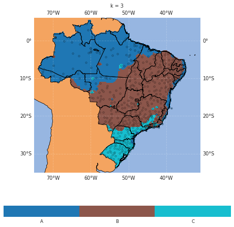


```python
k = 5
label_names = ABC[:k]
kmdf = df.copy()
kmdf['label'] = KMeans(k).fit_predict(X_num_sc)
knn_map(coords, kmdf['label'], extents, k=6,
        title=f'k = {k}', cmap='tab10', label_names=label_names)
kmdf['label'] = kmdf['label'].apply(lambda i: ABC[i])
table = kmdf.groupby('label').mean()[num_cols]
table
```


<div>
<style scoped>
    .dataframe tbody tr th:only-of-type {
        vertical-align: middle;
    }

    .dataframe tbody tr th {
        vertical-align: top;
    }

    .dataframe thead th {
        text-align: right;
    }
</style>
<table border="1" class="dataframe">
  <thead>
    <tr style="text-align: right;">
      <th></th>
      <th>H</th>
      <th>P</th>
      <th>R</th>
      <th>T</th>
      <th>V</th>
      <th>sH</th>
      <th>sP</th>
      <th>sR</th>
      <th>sT</th>
      <th>sV</th>
    </tr>
    <tr>
      <th>label</th>
      <th></th>
      <th></th>
      <th></th>
      <th></th>
      <th></th>
      <th></th>
      <th></th>
      <th></th>
      <th></th>
      <th></th>
    </tr>
  </thead>
  <tbody>
    <tr>
      <th>A</th>
      <td>77.715237</td>
      <td>936.752694</td>
      <td>131.557258</td>
      <td>18.568221</td>
      <td>2.437214</td>
      <td>15.778291</td>
      <td>3.504361</td>
      <td>81.140906</td>
      <td>4.187205</td>
      <td>1.441790</td>
    </tr>
    <tr>
      <th>B</th>
      <td>62.843136</td>
      <td>973.805697</td>
      <td>47.044211</td>
      <td>26.302958</td>
      <td>2.353962</td>
      <td>16.386361</td>
      <td>1.903479</td>
      <td>39.708409</td>
      <td>3.711818</td>
      <td>1.306529</td>
    </tr>
    <tr>
      <th>C</th>
      <td>79.260399</td>
      <td>998.290966</td>
      <td>150.021912</td>
      <td>25.519541</td>
      <td>1.286348</td>
      <td>12.471095</td>
      <td>2.111841</td>
      <td>86.898189</td>
      <td>2.953779</td>
      <td>0.917065</td>
    </tr>
    <tr>
      <th>D</th>
      <td>69.910244</td>
      <td>955.436805</td>
      <td>98.033751</td>
      <td>23.691279</td>
      <td>1.677611</td>
      <td>17.076527</td>
      <td>2.192721</td>
      <td>61.138962</td>
      <td>4.133665</td>
      <td>1.165710</td>
    </tr>
    <tr>
      <th>E</th>
      <td>77.750806</td>
      <td>1004.947945</td>
      <td>87.657846</td>
      <td>24.114372</td>
      <td>3.372434</td>
      <td>11.739555</td>
      <td>2.525400</td>
      <td>62.867451</td>
      <td>2.565787</td>
      <td>1.649047</td>
    </tr>
  </tbody>
</table>
</div>


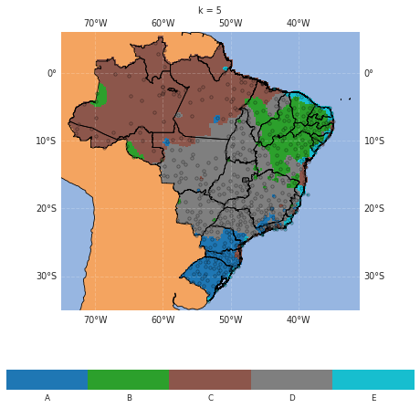


## Schematic variable maps


```python
sdf = kmdf[num_cols+['label']].copy()

knn = KNeighborsClassifier(5)
X = coords
y = sdf['label']
knn.fit(X,y)

ŷ = knn.predict(X)
sdf['label'] = ŷ

for c in num_cols:
    for l in label_names:
        sdf.loc[sdf['label']==l, c] = table.loc[l,c]
```


```python
variables = ['T', 'H', 'P', 'R', 'V']
stds = ['s' + c for c in variables]

T, H, P, R, V = [sdf[[c for c in sdf.columns if c.startswith(var)]].mean(axis=1)
                 for var in variables]
sT, sH, sP, sR, sV = [sdf[[c for c in sdf.columns if c.startswith(var)]].mean(axis=1)
                      for var in stds]
```


```python
fig, axes = plt.subplots(2, 3, figsize=(14,10), subplot_kw={'projection':projection})

knn_map(coords, T, extents, k=1, n_cmap=5, ax=axes.flat[0], cbar_label=r'Temperature ($^{\circ}C$)', cmap='RdBu_r')
knn_map(coords, H, extents, k=1, n_cmap=5, ax=axes.flat[1], cbar_label=r'Humidity (%)', cmap='Spectral')
knn_map(coords, P, extents, k=1, n_cmap=5, ax=axes.flat[2], cbar_label=r'Pressure (mB)', cmap=grey_blue)
knn_map(coords, R, extents, k=1, n_cmap=5, ax=axes.flat[3], cbar_label=r'Precipitation (mm)', cmap='Blues')
knn_map(coords, V, extents, k=1, n_cmap=5, ax=axes.flat[4], cbar_label=r'Wind (m/s)', cmap='viridis')
axes.flat[-1].remove()
```


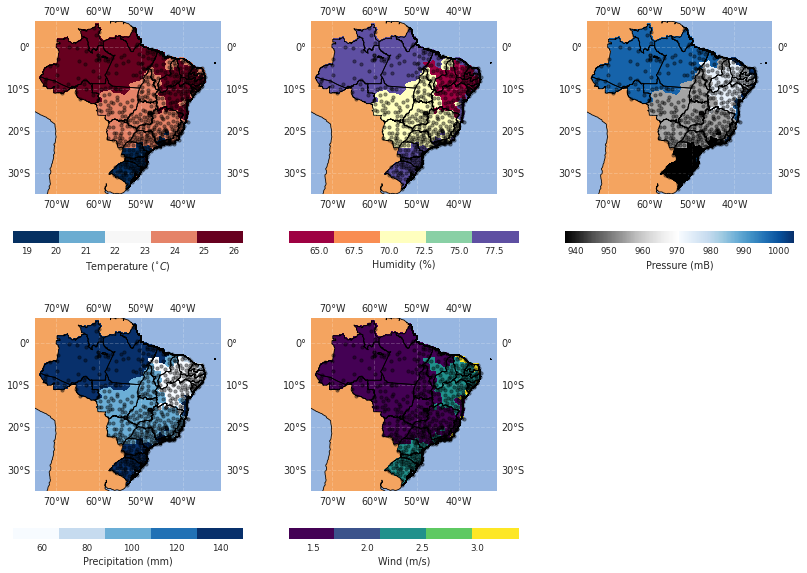


```python
fig, axes = plt.subplots(2,3, figsize=(14,10), subplot_kw={'projection':projection})
scmap = 'tab10'
knn_map(coords, sT, extents, k=1, n_cmap=5, ax=axes.flat[0], cbar_label=r'Temperature ($^{\circ}C$)', cmap=scmap)
knn_map(coords, sH, extents, k=1, n_cmap=5, ax=axes.flat[1], cbar_label=r'Humidity (%)', cmap=scmap)
knn_map(coords, sP, extents, k=1, n_cmap=5, ax=axes.flat[2], cbar_label=r'Pressure (mB)', cmap=scmap, vmax=6)
knn_map(coords, sR, extents, k=1, n_cmap=5, ax=axes.flat[3], cbar_label=r'Precipitation (mm)', cmap=scmap)
knn_map(coords, sV, extents, k=1, n_cmap=5, ax=axes.flat[4], cbar_label=r'Wind (m/s)', cmap=scmap, vmax=2)
axes.flat[-1].remove()
```


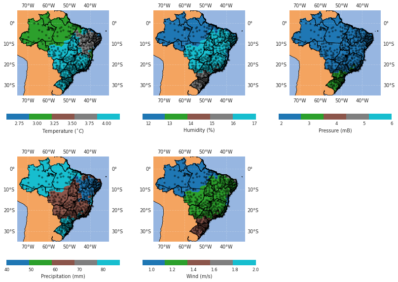


## Misc. - Using categoric variables


```python
X_all = df[coord_cols+cat_cols+pca_cols]
X_all.head()
```


<div>
<style scoped>
    .dataframe tbody tr th:only-of-type {
        vertical-align: middle;
    }

    .dataframe tbody tr th {
        vertical-align: top;
    }

    .dataframe thead th {
        text-align: right;
    }
</style>
<table border="1" class="dataframe">
  <thead>
    <tr style="text-align: right;">
      <th></th>
      <th>lon</th>
      <th>lat</th>
      <th>NE</th>
      <th>N</th>
      <th>CO</th>
      <th>S</th>
      <th>SE</th>
      <th>1</th>
      <th>2</th>
      <th>3</th>
      <th>4</th>
      <th>5</th>
    </tr>
  </thead>
  <tbody>
    <tr>
      <th>0</th>
      <td>-47.925833</td>
      <td>-15.789444</td>
      <td>1</td>
      <td>0</td>
      <td>0</td>
      <td>0</td>
      <td>0</td>
      <td>-0.847106</td>
      <td>0.981557</td>
      <td>-0.052871</td>
      <td>-1.698452</td>
      <td>0.598127</td>
    </tr>
    <tr>
      <th>1</th>
      <td>-48.131111</td>
      <td>-15.599722</td>
      <td>1</td>
      <td>0</td>
      <td>0</td>
      <td>0</td>
      <td>0</td>
      <td>-0.873402</td>
      <td>0.710085</td>
      <td>0.442283</td>
      <td>-1.934483</td>
      <td>0.516722</td>
    </tr>
    <tr>
      <th>2</th>
      <td>-50.141389</td>
      <td>-15.939167</td>
      <td>0</td>
      <td>0</td>
      <td>0</td>
      <td>0</td>
      <td>1</td>
      <td>-0.673966</td>
      <td>-0.644175</td>
      <td>-1.163536</td>
      <td>-0.506441</td>
      <td>-0.688486</td>
    </tr>
    <tr>
      <th>3</th>
      <td>-60.016389</td>
      <td>-3.103333</td>
      <td>0</td>
      <td>0</td>
      <td>0</td>
      <td>1</td>
      <td>0</td>
      <td>2.021792</td>
      <td>-1.957614</td>
      <td>-0.381864</td>
      <td>0.140697</td>
      <td>-0.009066</td>
    </tr>
    <tr>
      <th>4</th>
      <td>-69.866944</td>
      <td>-6.650278</td>
      <td>0</td>
      <td>0</td>
      <td>0</td>
      <td>1</td>
      <td>0</td>
      <td>2.036194</td>
      <td>-1.260124</td>
      <td>-1.246281</td>
      <td>0.146786</td>
      <td>-0.392069</td>
    </tr>
  </tbody>
</table>
</div>


```python
view_cluster_silhouettes(KMeans, X_all, 2, 9)
```

    No handles with labels found to put in legend.


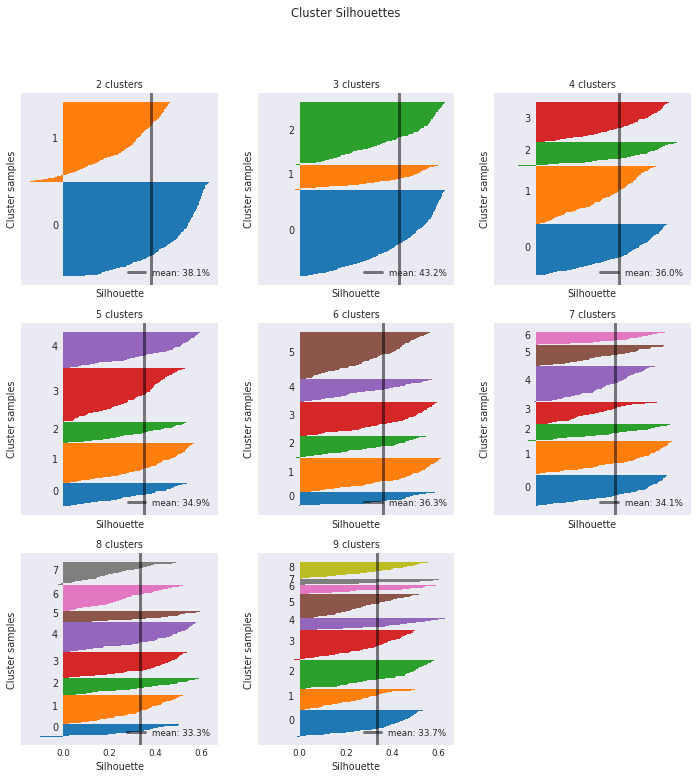


```python
elbow_analysis(KMeans, X_all, k_max=15)
```


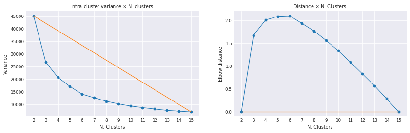


```python
plot_silhouette(KMeans, X_all, k_max=15)
```


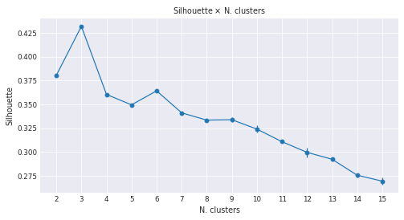


```python
range_k = [3,5,6,7]
labels = []
label_names = []
for k in range_k:
    labels.append(KMeans(k).fit_predict(X_all))
    label_names.append(ABC[:k])
```


```python
fig, axes = plt.subplots(2,2, figsize=(14,10), subplot_kw={'projection':projection})

for i, ax in enumerate(axes.flat):
    k = range_k[i]
    knn_map(coords, labels[i], extents, k=6,
            title=f'k = {k}', ax=axes.flat[i],
            cmap='tab10', label_names=label_names[i],)
```


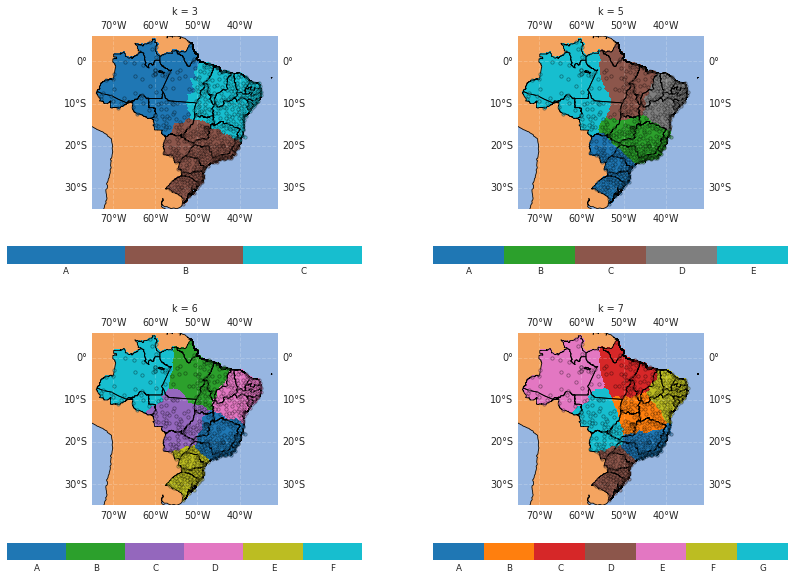

